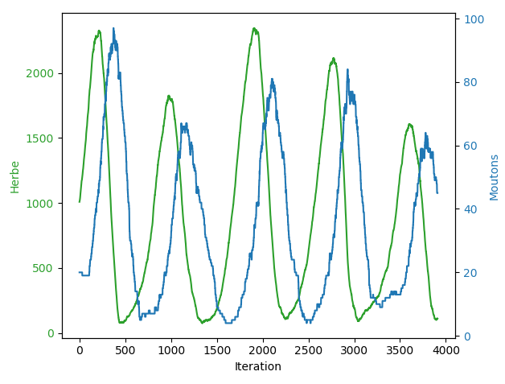

# Loup Et Mouton

## Principe :

Simulation d'une population de plante, de monton et de loups

## Exemples de résultats :

 

Evolution de la population de moutons et de la quantitée d'herbe dans un cas sans loups :

 

Visuel de la simulation

## Comment l'ouvrir et le lancer :
-Télécharger Processing 3 : https://processing.org/download/

-Ouvrir et lancer "LoupEtMouton.pde" avec Processing 3

## Utilisation

Pour sauvegarder les données : garder appuyer la touche espace, puis cliquer
